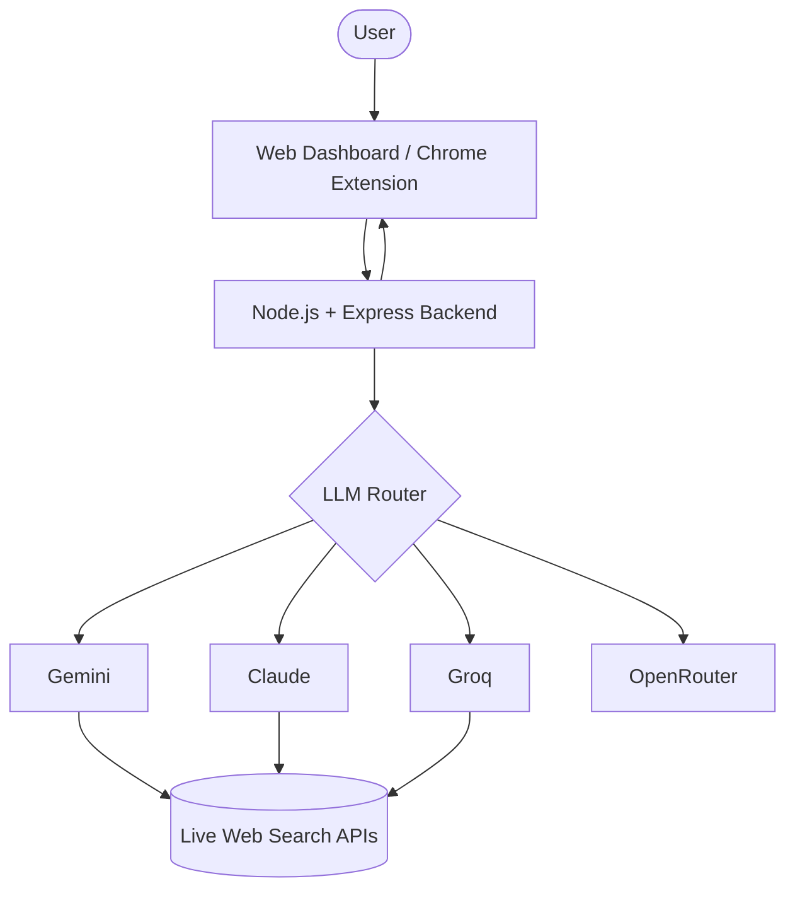

# 1. Problem Statement
Generative AI models often produce "hallucinations"—factual errors presented with high confidence—and fake citations. This undermines trust in AI-generated content for research, journalism, and decision-making. **TrustGuard AI** serves as a "Truth Layer" that automatically extracts factual claims from any text, cross-references them with real-time web search data, and provides a visual trust score to help users distinguish between fact and fiction.

## 🚀 Project Overview
TrustGuard AI is a comprehensive AI safety tool consisting of a **FastAPI Backend**, a **React Web Dashboard**, and a **Chrome Extension**. It allows users to highlight any text on the web and instantly verify its accuracy. The system uses Google Gemini 3 Flash (Preview) for claim extraction and verification, combined with DuckDuckGo for real-time fact-checking.

### ✨ Key Features:
- **Real-time Fact Checking:** Cross-references claims with live search results using AI-generated search queries.
- **Visual Trust Score:** Provides an overall percentage score (Verified=100%, Uncertain=50%, Hallucinated=0%) with a dynamic gauge.
- **API Key Rotation & Cooldown:** Automatically switches between multiple Gemini API keys with a 60s cooldown to bypass free-tier rate limits.
- **Multi-LLM Fallback:** Uses Groq (Llama 3.3-70B) as a zero-downtime fallback if all Gemini keys are exhausted.
- **Parallel Processing:** Verifies multiple claims simultaneously for near-instant results.
- **Dark/Light Mode:** Fully responsive UI with a high-tech "Cyber" dark mode and a clean, professional light mode.
- **Citation Verification:** Checks if mentioned sources actually exist and provides direct evidence links.
- **Multilingual Support:** Automatically detects the input language (e.g., Hindi, Spanish) and provides verification explanations in the native language.

---

## 🛠️ Tech Stack
- **Frontend**: React, TypeScript, Vite, Tailwind CSS, Shadcn UI, Lucide React.
- **Backend**: FastAPI, Python, Uvicorn, Pydantic.
- **AI Models**: Google Gemini 3 Flash (Preview), Groq (Llama 3.3 70B).
- **Search APIs**: Tavily AI (Primary/High-Quality), DuckDuckGo Search (Fallback/Zero-Config).
- **Theme Management**: `next-themes`.

---
## System Architecture

----

## 🔑 Supported Models

| Model | Provider | Speed | Quality | Free Tier |
|-------|----------|-------|---------|-----------|
| **Claude Sonnet 4** | Anthropic | Fast | Excellent | No (Paid) |
| **Gemini 1.5 Flash** | Google | Very Fast | Good | Yes |
| **Llama 3.3 70B** | Groq | Ultra Fast | Good | Yes |
| **Mistral 7B** | OpenRouter | Fast | Decent | Yes |

---
## 📦 Setup and Installation

### Prerequisites
- Node.js (v18 or higher)
- API Keys for your preferred LLM providers (e.g., Groq, Gemini, Claude)

### 1. Backend Setup

Navigate to the backend directory and install dependencies:

```bash
cd backend
npm install
```

Create a `.env` file in the `backend` directory with your API keys:
```env
PORT=8000
GROQ_API_KEY=your_groq_api_key
GEMINI_API_KEY=your_gemini_api_key
CLAUDE_API_KEY=your_claude_api_key
```

Start the backend development server:
```bash
npm run dev
```

### 2. Frontend Web Dashboard Setup

Open a new terminal, navigate to the frontend directory, and install dependencies:

```bash
cd frontend
npm install
```

Create a `.env` file in the `frontend` directory:
```env
VITE_API_URL=http://localhost:8000
```

Start the frontend development server:
```bash
npm run dev
```

### 3. Chrome Extension Setup

1. Open Google Chrome and navigate to `chrome://extensions/`.
2. Enable **Developer mode** in the top right corner.
3. Click **Load unpacked**.
4. Select the `frontend/extension` folder from this repository.

---

## 📖 Usage Instructions

1. **Web Dashboard:** Open the web interface running on localhost, paste any text (such as an AI-generated article), and click "Verify Content" to see a complete claim breakdown and trust score.
2. **Chrome Extension:** Highlight any questionable text on any webpage, right-click, and select **"Verify with TrustGuard AI"**. A floating Truth Layer will display the fact-check results instantly.

## 🚀 Future Enhancements

- **User Accounts & History:** Allow users to save their verification results and build a personal fact-checking database.
- **Enhanced Search Integrations:** Add specialized search endpoints for medical, legal, or financial fact-checking.
- **Deepfake Detection:** Integrate visual and audio analysis to verify multimedia content alongside text.
- **Collaborative Fact-Checking:** Allow community annotations and upvoting for edge-case claims.
- **Deep Fake & Synthetic Media Detection:** Integrate visual and audio analysis to verify multimedia content alongside text.
- **Image Verification:** Integrate visual and audio analysis to verify multimedia content alongside text.
---

## 🤝 Contributing

Contributions are welcome! Whether it's adding new AI model integrations, improving the search fallback logic, or refining the UI, please feel free to submit a Pull Request.

## 📄 License

MIT License - Use freely!
