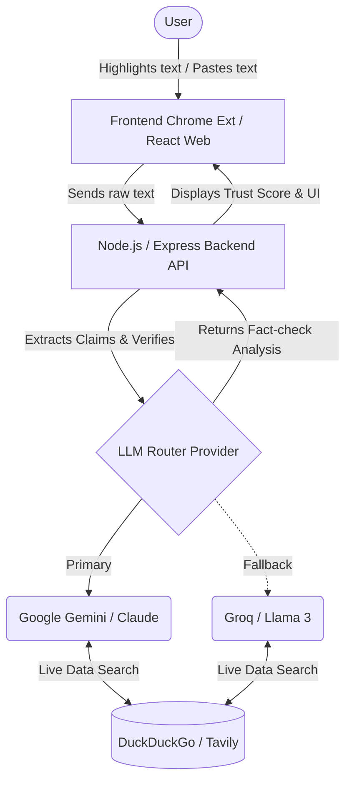
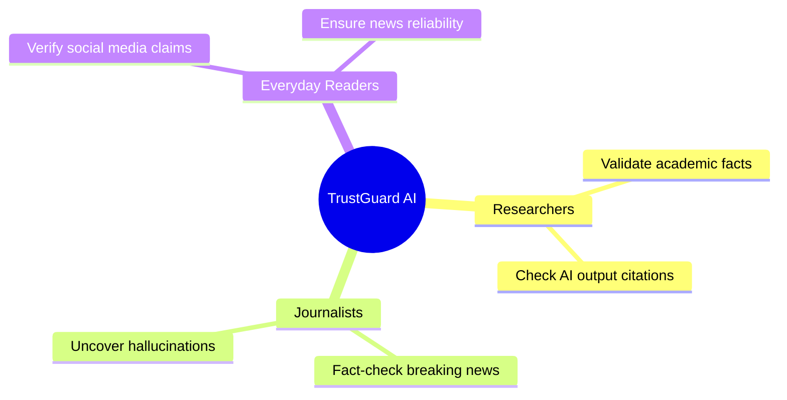

# TrustGuard AI 🛡️

**TrustGuard AI** is a comprehensive verification tool and "Truth Layer" designed to detect AI hallucinations, factual errors, and fake citations. By automatically extracting factual claims from any text and cross-referencing them against real-time data, TrustGuard AI helps users confidently distinguish between fact and fiction.

## 🚀 Project Overview

TrustGuard AI provides users with multiple ways to verify content, including a modern Web Dashboard and a convenient Chrome Extension. It leverages multiple LLMs to ensure high availability and accuracy for real-time fact-checking.

**Key Features:**
- **Real-time Fact Checking:** Automatically generates search queries and cross-references claims with live data.
- **Visual Trust Score:** Get instant feedback via a percentage-based gauge (Verified, Uncertain, or Hallucinated).
- **Multi-Model Fallback System:** Built-in support and automatic fallback across top-tier models (Claude, Gemini, Groq, OpenRouter) to ensure zero downtime and bypass rate limits.
- **Citation Verification:** Confirms whether cited sources exist and provides direct links to the evidence.
- **Multilingual Support:** Automatically detects the input language and provides verification results in that same localized language.
- **Modern UI/UX:** Responsive design featuring dark/light modes powered by Shadcn UI and Tailwind CSS.

---

## 🏗️ System Architecture



## 🎯 Use Case Diagram



---

## 🛠️ Technology Stack

**Frontend**
- React 18 & TypeScript
- Vite, Tailwind CSS, & Shadcn UI
- React Query & Supabase
- Lucide Icons & next-themes

**Backend**
- Node.js & Express
- Integration with AI providers (Anthropic, Google, Groq, OpenRouter)
- Real-time Search APIs (DuckDuckGo, Tavily AI)

**Browser Extension**
- Chrome Extension (Manifest V3 compatible)

---

## 📦 Setup and Installation

### Prerequisites
- Node.js (v18 or higher)
- API Keys for your preferred LLM providers (e.g., Groq, Gemini, Claude)

### 1. Backend Setup

Navigate to the backend directory and install dependencies:

```bash
cd backend
npm install
```

Create a `.env` file in the `backend` directory with your API keys:
```env
PORT=8000
GROQ_API_KEY=your_groq_api_key
GEMINI_API_KEY=your_gemini_api_key
CLAUDE_API_KEY=your_claude_api_key
```

Start the backend development server:
```bash
npm run dev
```

### 2. Frontend Web Dashboard Setup

Open a new terminal, navigate to the frontend directory, and install dependencies:

```bash
cd frontend
npm install
```

Create a `.env` file in the `frontend` directory:
```env
VITE_API_URL=http://localhost:8000
```

Start the frontend development server:
```bash
npm run dev
```

### 3. Chrome Extension Setup

1. Open Google Chrome and navigate to `chrome://extensions/`.
2. Enable **Developer mode** in the top right corner.
3. Click **Load unpacked**.
4. Select the `frontend/extension` folder from this repository.

---

## 📖 Usage Instructions

1. **Web Dashboard:** Open the web interface running on localhost, paste any text (such as an AI-generated article), and click "Verify Content" to see a complete claim breakdown and trust score.
2. **Chrome Extension:** Highlight any questionable text on any webpage, right-click, and select **"Verify with TrustGuard AI"**. A floating Truth Layer will display the fact-check results instantly.

## 🚀 Future Enhancements

- **User Accounts & History:** Allow users to save their verification results and build a personal fact-checking database.
- **Enhanced Search Integrations:** Add specialized search endpoints for medical, legal, or financial fact-checking.
- **Deepfake Detection:** Integrate visual and audio analysis to verify multimedia content alongside text.
- **Collaborative Fact-Checking:** Allow community annotations and upvoting for edge-case claims.

---

## 🤝 Contributing

Contributions are welcome! Whether it's adding new AI model integrations, improving the search fallback logic, or refining the UI, please feel free to submit a Pull Request.

## 📄 License

This project is licensed under the MIT License. Use freely!