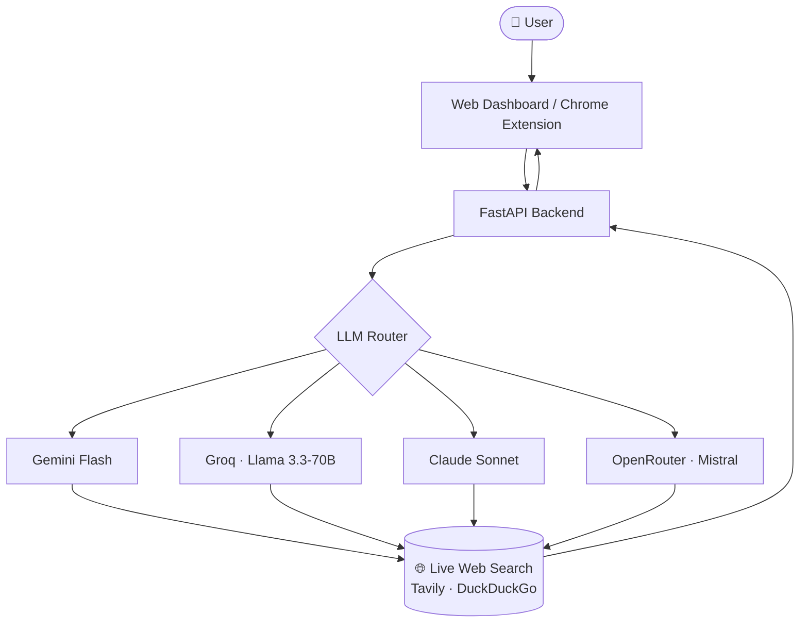

<div align="center">


[](#)
[](#)
[](https://fastapi.tiangolo.com)
[](https://reactjs.org)
[](https://deepmind.google/technologies/gemini)
[](LICENSE)

> AI hallucinates. **TrustGuard** catches it.  
> Real-time claim extraction, live web cross-referencing, and visual trust scoring —  
> as a **Web Dashboard**, **FastAPI Backend**, and **Chrome Extension**.


</div>

---

## 🧩 The Problem

| Issue | Real-World Impact |
|---|---|
| 🤖 AI hallucinations | Fabricated facts presented with full confidence |
| 📚 Fake citations | Non-existent papers and sources cited as real |
| 🔍 No verification layer | Users have no fast way to cross-check AI output |
| 🌐 Research & journalism risk | Misinformation propagates before it's caught |

**TrustGuard AI** sits between AI-generated content and the user — automatically extracting every factual claim, searching the live web for evidence, and returning a verdict with a trust score in seconds.

---

## ✨ Features

### 🔍 Core Verification Engine
- **Real-time fact checking** — live web search via Tavily AI (primary) and DuckDuckGo (fallback)
- **Visual trust score** — dynamic gauge: Verified (100%) / Uncertain (50%) / Hallucinated (0%)
- **Claim-by-claim breakdown** — every extracted claim gets its own verdict and evidence links
- **Citation verification** — checks whether cited sources actually exist

### ⚡ Reliability & Performance
- **API key rotation** — auto-switches between multiple Gemini keys with 60s cooldown to handle free-tier limits
- **Multi-LLM fallback** — drops to Groq (Llama 3.3-70B) if all Gemini keys are exhausted
- **Parallel processing** — all claims verified simultaneously for near-instant results

### 🌍 Accessibility
- **Multilingual support** — detects input language and returns explanations in the native language
- **Dark / Light mode** — high-tech Cyber dark mode + clean professional light mode

### 🧩 Three Interfaces
| Interface | How it works |
|---|---|
| 🌐 Web Dashboard | Paste any text → click Verify → get full trust report |
| 🔌 Chrome Extension | Highlight text on any webpage → right-click → "Verify with TrustGuard AI" |
| ⚙️ FastAPI Backend | REST API for programmatic access and integrations |

---

## 🤖 Supported Models

| Model | Provider | Speed | Quality | Free Tier |
|---|---|---|---|---|
| Gemini 1.5 Flash | Google | ⚡ Very Fast | ✅ Good | ✅ Yes |
| Llama 3.3 70B | Groq | ⚡⚡ Ultra Fast | ✅ Good | ✅ Yes |
| Claude Sonnet 4 | Anthropic | ⚡ Fast | 🌟 Excellent | ❌ Paid |
| Mistral 7B | OpenRouter | ⚡ Fast | ➖ Decent | ✅ Yes |

---

## 🏗️ System Architecture

```mermaid
graph TD
    User([👤 User])
    FE[Web Dashboard / Chrome Extension]
    API[FastAPI Backend]
    Router{LLM Router}
    Gemini[Gemini Flash]
    Groq[Groq · Llama 3.3-70B]
    Claude[Claude Sonnet]
    OpenRouter[OpenRouter · Mistral]
    Search[(🌐 Live Web Search\nTavily · DuckDuckGo)]

    User --> FE
    FE --> API
    API --> Router
    Router --> Gemini
    Router --> Groq
    Router --> Claude
    Router --> OpenRouter
    Gemini --> Search
    Groq --> Search
    Claude --> Search
    OpenRouter --> Search
    Search --> API
    API --> FE
```

---

## 🛠️ Tech Stack

### Frontend


### Backend


### AI & Search


---

## 📂 Project Structure
```
trustguard-ai/
├── backend/
│   ├── main.py                  # FastAPI app entry point
│   ├── routers/
│   │   └── verify.py            # /verify endpoint
│   ├── services/
│   │   ├── llm_router.py        # Multi-LLM routing + key rotation
│   │   ├── claim_extractor.py   # Gemini claim extraction
│   │   ├── fact_checker.py      # Search + verification logic
│   │   └── search.py            # Tavily + DuckDuckGo fallback
│   ├── models/
│   │   └── schemas.py           # Pydantic request/response models
│   ├── .env                     # API keys (never commit)
│   └── requirements.txt
├── frontend/
│   ├── src/
│   │   ├── components/
│   │   │   ├── TrustGauge.tsx   # Visual trust score gauge
│   │   │   ├── ClaimCard.tsx    # Per-claim verdict display
│   │   │   ├── ResultPanel.tsx  # Full verification results
│   │   │   └── ThemeToggle.tsx  # Dark/light mode switch
│   │   ├── App.tsx
│   │   ├── main.tsx
│   │   └── index.css
│   ├── extension/               # Chrome extension source
│   │   ├── manifest.json
│   │   ├── background.js
│   │   └── content.js
│   ├── .env
│   └── package.json
└── README.md
```

---

## 🚀 Getting Started

### Prerequisites
- Node.js **v18+**
- Python **3.9+**
- API keys for at least one LLM provider

### 1. Clone the Repository
```bash
git clone https://github.com/Saif8671/trustguard-ai.git
cd trustguard-ai
```

### 2. Backend Setup
```bash
cd backend
pip install -r requirements.txt
```

Create a `.env` file in the `backend/` directory:
```env
GEMINI_API_KEY=your_gemini_api_key
GEMINI_API_KEY_2=your_second_key        # optional — enables key rotation
GROQ_API_KEY=your_groq_api_key
CLAUDE_API_KEY=your_claude_api_key
TAVILY_API_KEY=your_tavily_api_key
```

Start the backend:
```bash
uvicorn main:app --reload --port 8000
```

### 3. Frontend Setup
```bash
cd frontend
npm install
```

Create a `.env` file in the `frontend/` directory:
```env
VITE_API_URL=http://localhost:8000
```

Start the frontend:
```bash
npm run dev
```

Open [http://localhost:5173](http://localhost:5173) in your browser.

### 4. Chrome Extension Setup

1. Open Chrome and go to `chrome://extensions/`
2. Enable **Developer mode** (top-right toggle)
3. Click **Load unpacked**
4. Select the `frontend/extension/` folder

> ⚠️ **Never commit your `.env` files.** Ensure both are listed in `.gitignore`.

---

## 📖 Usage

### Web Dashboard
1. Open the app at `localhost:5173`
2. Paste any AI-generated or questionable text
3. Click **"Verify Content"**
4. Review the trust score, claim verdicts, and evidence links

### Chrome Extension
1. Highlight any text on any webpage
2. Right-click → **"Verify with TrustGuard AI"**
3. A floating Truth Layer panel displays results inline

### API (Direct)
```bash
curl -X POST http://localhost:8000/verify \
  -H "Content-Type: application/json" \
  -d '{"text": "The Eiffel Tower was built in 1887 and stands 450 meters tall."}'
```

---

## 🖼️ Screenshots

| Web Dashboard — Dark Mode | Web Dashboard — Light Mode |
|---|---|
|  |  |

| Chrome Extension | Trust Score Gauge |
|---|---|
|  |  |

*(Replace placeholders with actual screenshots)*

---

## 🗺️ Roadmap

- [ ] User accounts and verification history
- [ ] Specialized search for medical, legal, and financial claims
- [ ] Deepfake and synthetic media detection (image + audio)
- [ ] Community annotations and collaborative fact-checking
- [ ] Browser extension for Firefox and Edge
- [ ] Exportable verification reports (PDF)
- [ ] Webhook integration for Slack and Teams alerts

---

## 🤝 Contributing

Contributions are welcome — new LLM integrations, improved search fallback logic, UI refinements, or language support.

1. Fork the repo
2. Create a branch: `git checkout -b feat/your-feature`
3. Commit: `git commit -m "feat: describe your change"`
4. Push and open a PR

---

## 📄 License

MIT © [Saif ur Rahman](https://github.com/Saif8671)

---

<div align="center">

Because the truth still matters. 🔍

[](https://github.com/Saif8671)
[](https://saif-portfolio8671.netlify.app)


</div>
