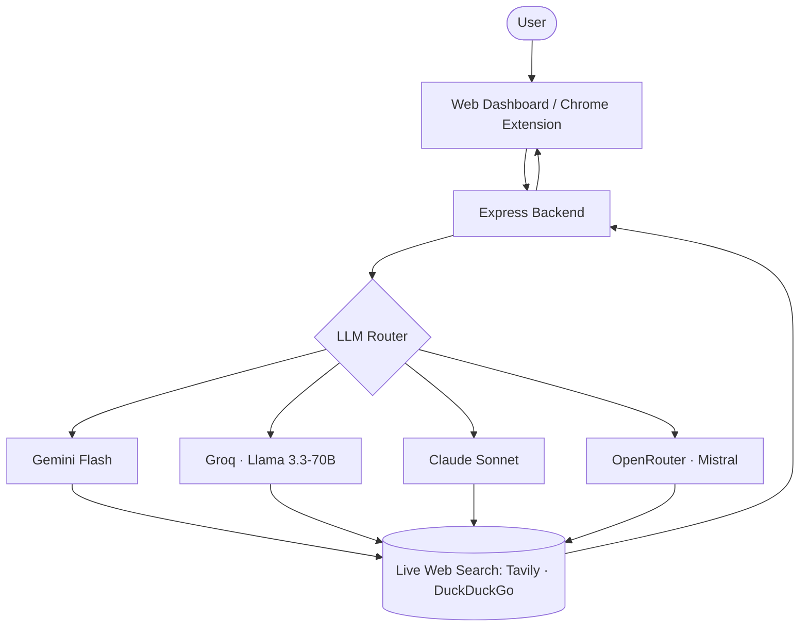

<div align="center">

[](https://ai-halucination-verifiyer.vercel.app/)


</div>

---

## Overview

**TrustGuard AI** sits between AI-generated content and the user — automatically extracting every factual claim, searching the live web for evidence, and returning a per-claim verdict with a visual trust score in seconds.

AI hallucinates. TrustGuard catches it. Available as a web dashboard, Node/Express backend, and Chrome extension.

---

## The Problem

| Issue | Real-World Impact |
|---|---|
| AI hallucinations | Fabricated facts presented with complete confidence |
| Fake citations | Non-existent papers and sources cited as real |
| No verification layer | Users have no fast way to cross-check AI output |
| Research & journalism risk | Misinformation propagates before it's caught |

---

## Features

### Verification Engine
- **Real-time fact checking** — live web search via Tavily AI (primary) with DuckDuckGo fallback
- **Visual trust score** — dynamic gauge: Verified (100%) / Uncertain (50%) / Hallucinated (0%)
- **Claim-by-claim breakdown** — every extracted claim gets its own verdict and evidence links
- **Citation verification** — checks whether cited sources actually exist and are accessible

### Reliability & Performance
- **API key rotation** — auto-switches between multiple Gemini keys with 60s cooldown to handle free-tier rate limits
- **Multi-LLM fallback** — drops to Groq (Llama 3.3-70B) if all Gemini keys are exhausted
- **Parallel claim processing** — all claims verified simultaneously for near-instant results

### Accessibility
- **Multilingual support** — detects input language and returns explanations in the same language
- **Dark / Light mode** — high-contrast cyber dark mode and clean professional light mode

### Three Interfaces

| Interface | How It Works |
|---|---|
| **Web Dashboard** | Paste any text → click Verify → get full trust report |
| **Chrome Extension** | Highlight text on any webpage → right-click → "Verify with TrustGuard AI" |
| **Express Backend** | REST API for programmatic access and integrations |

---

## Supported Models

| Model | Provider | Speed | Free Tier |
|---|---|---|---|
| Gemini 1.5 Flash | Google | ⚡ Very fast | ✅ Yes |
| Llama 3.3 70B | Groq | ⚡ Ultra fast | ✅ Yes |
| Claude Sonnet 4 | Anthropic | ⚡ Fast | ❌ Paid |
| Mistral 7B | OpenRouter | ⚡ Fast | ✅ Yes |

---

## Architecture


```mermaid
graph TD
    User([User])
    FE[Web Dashboard / Chrome Extension]
    API[Express Backend]
    Router{LLM Router}
    Gemini[Gemini Flash]
    Groq[Groq · Llama 3.3-70B]
    Claude[Claude Sonnet]
    OpenRouter[OpenRouter · Mistral]
    Search[(Live Web Search: Tavily · DuckDuckGo)]

    User --> FE
    FE --> API
    API --> Router
    Router --> Gemini
    Router --> Groq
    Router --> Claude
    Router --> OpenRouter
    Gemini --> Search
    Groq --> Search
    Claude --> Search
    OpenRouter --> Search
    Search --> API
    API --> FE
```

---

## Tech Stack

| Layer | Technology |
|---|---|
| Frontend | React, TypeScript, Vite, Tailwind CSS, shadcn/ui |
| Backend | Node.js, Express, Multer, node-fetch |
| AI Models | Gemini 1.5 Flash, Groq Llama 3.3-70B, Claude Sonnet, Mistral via OpenRouter |
| Search | Tavily AI (primary), DuckDuckGo (fallback) |
| Extension | Chrome Manifest V3 |

---

## Project Structure

```
trustguard-ai/
├── backend/
│   ├── server.js                 # Express API entry point
│   ├── extract.js                # URL / PDF text extraction helpers
│   ├── test.js                   # Local API smoke tests
│   ├── package.json
│   └── .env                      # API keys — never commit
├── frontend/
│   ├── src/
│   │   ├── components/
│   │   │   ├── TrustGauge.tsx    # Visual trust score gauge
│   │   │   ├── ClaimCard.tsx     # Per-claim verdict display
│   │   │   ├── ResultPanel.tsx   # Full verification results
│   │   │   └── ThemeToggle.tsx   # Dark/light mode switch
│   │   ├── App.tsx
│   │   └── main.tsx
│   ├── extension/                # Chrome extension source
│   │   ├── manifest.json
│   │   ├── background.js
│   │   └── content.js
│   └── package.json
└── README.md
```

---

## Getting Started

**Prerequisites:** Node.js 18+, at least one LLM API key

### 1. Clone the repository

```bash
git clone https://github.com/Saif8671/trustguard-ai.git
cd trustguard-ai
```

### 2. Backend setup

```bash
cd backend
npm install
```

Create `backend/.env`:

```env
GEMINI_API_KEY=your_gemini_api_key
GEMINI_API_KEY_2=your_second_key       # optional — enables key rotation
GROQ_API_KEY=your_groq_api_key
CLAUDE_API_KEY=your_claude_api_key
TAVILY_API_KEY=your_tavily_api_key
```

```bash
npm start
```

### 3. Frontend setup

```bash
cd frontend
npm install
```

Create `frontend/.env`:

```env
# Optional: point directly at the backend. If omitted, the frontend uses /api/*
VITE_API_URL=http://localhost:3001
```

```bash
npm run dev
```

Open `http://localhost:8080`.

### 4. Chrome extension setup

1. Go to `chrome://extensions/`
2. Enable **Developer mode**
3. Click **Load unpacked**
4. Select the `frontend/extension/` folder

> Never commit your `.env` files. Ensure both are listed in `.gitignore`.

---

## Usage

**Web Dashboard** — paste any AI-generated or questionable text, click **Verify Content**, and review the trust score, per-claim verdicts, and evidence links.

**Chrome Extension** — highlight any text on any webpage, right-click, select **"Verify with TrustGuard AI"**, and a floating panel displays results inline.

### Test Samples

Paste any of these into the dashboard to quickly test different verification paths:

1. `The Eiffel Tower was completed in 1889 and is located in Paris.`
2. `The Moon is made of cheese and humans can breathe there without oxygen.`
3. `Water boils at 100 degrees Celsius at sea level, and gold is a liquid at room temperature.`
4. `According to a 2023 Nature study, global temperatures increased by 3.5 C since 1900.`
5. `Python was created by Guido van Rossum and first released in 1991.`

**Direct API**

```bash
curl -X POST http://localhost:3001/api/verify \
  -H "Content-Type: application/json" \
  -d '{"aiText": "The Eiffel Tower was built in 1887 and stands 450 meters tall.", "model": "auto"}'
```

---

## Roadmap

| Status | Feature |
|---|---|
| 📋 Planned | User accounts and verification history |
| 📋 Planned | Specialized claim scoring for medical, legal, and financial content |
| 📋 Planned | Deepfake and synthetic media detection (image + audio) |
| 📋 Planned | Firefox and Edge extension support |
| 📋 Planned | Exportable verification reports (PDF) |
| 💡 Idea | Community annotations and collaborative fact-checking |
| 💡 Idea | Slack / Teams webhook integration |

---

## Contributing

Contributions are welcome — new LLM integrations, improved search fallback logic, UI refinements, or language support.

1. Fork the repository
2. Create a feature branch: `git checkout -b feat/your-feature`
3. Commit with conventional messages: `git commit -m "feat: describe your change"`
4. Push and open a pull request

---

## License

MIT © [Saif ur Rahman](https://github.com/Saif8671)
Free to use, modify, and distribute with attribution.

---

<div align="center">

**Built by [Saif ur Rahman](https://github.com/Saif8671)**

[](https://github.com/Saif8671)
[](https://linkedin.com/in/saif-ur-rahman-0211002b9)
[](https://saif-portfolio8671.netlify.app)
[](mailto:saifurrahman887@gmail.com)

<br/>

*Because the truth still matters.*


</div>
